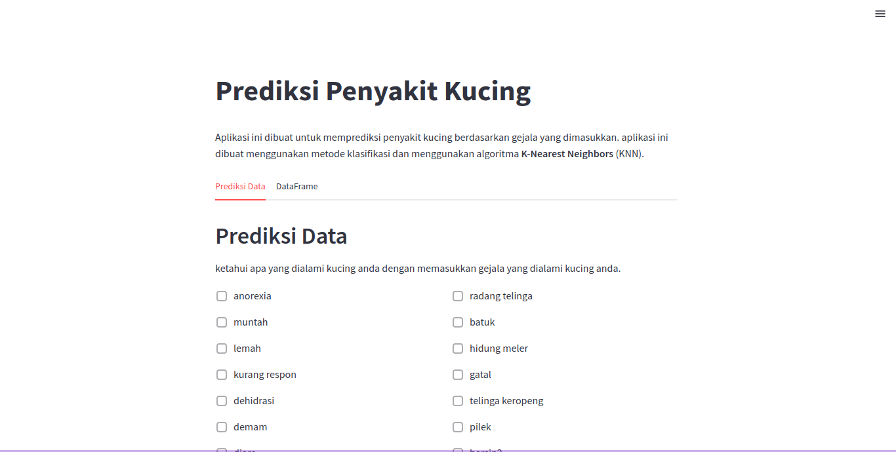
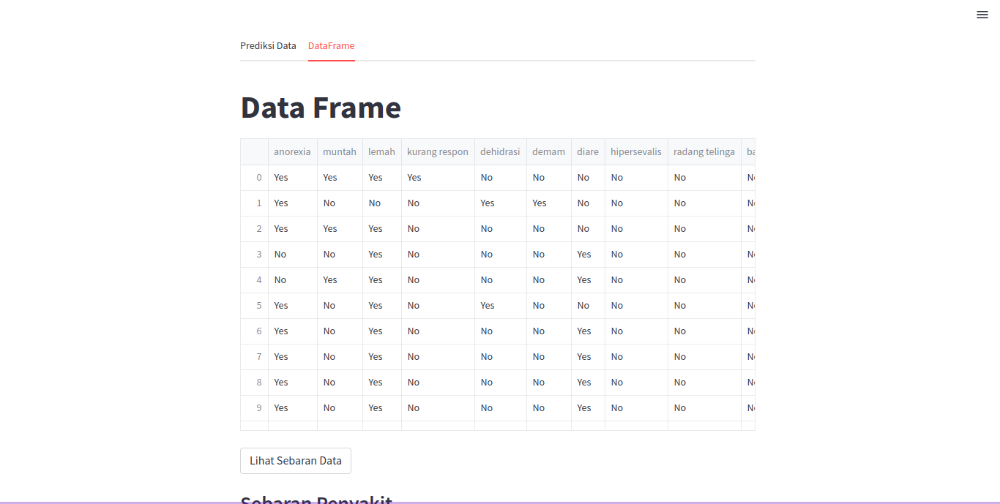

# Prediksi Penyakit Kucing
Aplikasi ini adalah aplikasi yang dapat digunakan untuk memprediksi penyakit kucing. Aplikasi ini dibuat menggunakan bahasa pemrograman Python dan menggunakan algoritma Data Minig yaitu K-Nearest Neighbors (KNN) untuk memprediksi penyakit kucing. 

## Demo
| | |
| :---: | :---: |
|  |  |

## Requirements
- Python 3.6
- Pandas
- Scikit-learn
- Math
- Streamlit

## How to run
1. Clone this repository
2. Install all requirements
3. Run `streamlit run main.py`

## How to use
1. Input gejalanya
2. Click "Prediksi" button
3. See the result
